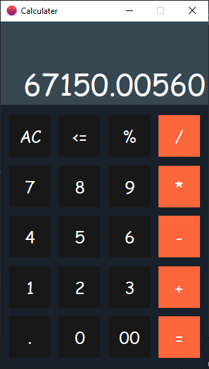
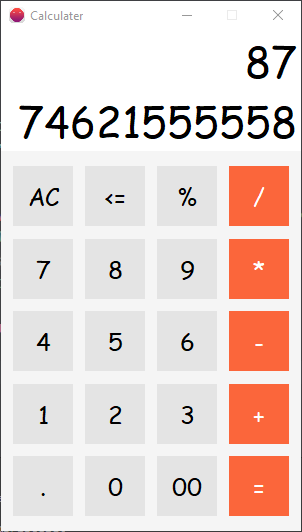

# Calculater

This project is made using `Java Swing`. You can download this project. If you like this project, please give a 🌟 to this project. It has two color theme, means light and dark. But currently I have not added theme toggle button in this project. 

This project has two files `panel.java` and `Calculater.java`. All the main logic for the project are in `panel.java`. 

In `panel.java` from line 27 to line 30 are light colors and from line 33 to line 36 are light colors. 

For the light theme uncomment light colors and comment dark colors, For For the light theme uncomment dark colors and comment light colors.

# Images

